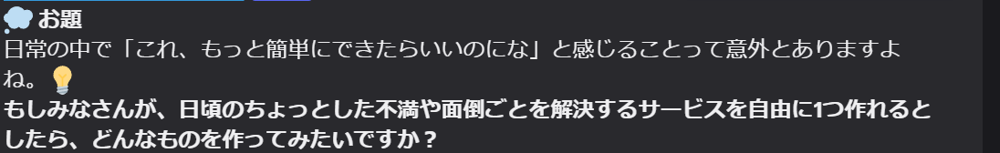
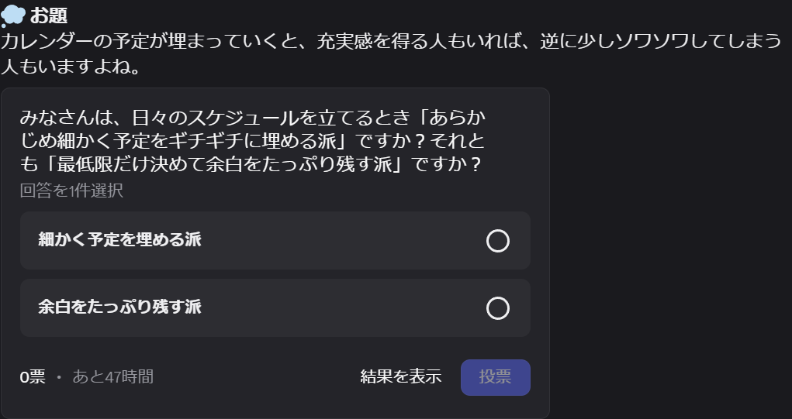

# 提案: 自己紹介→話題投下機能の導入について

Bot 運用者さま向けの機能提案資料です。動作するプロトタイプがあり、デモ可能です。

## 1. 提案概要

自己紹介チャンネルへの新規投稿は、リアクションやリプライが自己紹介チャンネル内で完結してしまい、交流に発展しにくいという課題があります。

この機能は、**表向きは「2日に1回お題を投下する定期 bot」**として振る舞いながら、裏では自己紹介から専攻・興味を抽出し、その人が話しやすそうな「専門でない人も答えられる問い」を選んで雑談・交流チャンネルに投下します。オンボーディング DM と同じ思想で、**「見てる感」は一切出しません** — 投稿は誰にも言及せず、投稿タイミングも自己紹介と相関しない定期スケジュールです。

例: 哲学専攻の自己紹介がある → 雑談チャンネルに

```
💭 今日のお題
**記憶をすべて失っても、その人は同じ人だと思いますか？**
-# 一言でも、リアクションだけでも歓迎
```

見出し（1行目）と末尾の一言は設定で変更でき、**毎回同じ体裁**で投稿されます。お題の形式によって見出しや装飾を変えることはしません。

**見た目の設計判断**: この機能はあえて embed（枠付きカード）を使わず、プレーンテキストの固定フォーマットで投稿します。理由は3つあります。第一に、投稿するのは雑談チャンネルが静かなタイミングだけなので、お題は必ず「最新のメッセージ」として目に入り、embed の枠で目立たせる必要が構造的にありません。第二に、プレーンテキストなら**返信の引用に問いがそのまま乗る**ため、あとから流れを追う人にも何への返信か伝わります（embed は返信引用に本文が乗りません）。第三に、embed は「埋め込みを表示しない」というユーザー側の設定で消えてしまう可能性がありますが、通常のメッセージなら誰の環境でも同じように見えます。装飾で目を引くより、雑談の流れに自然に混ざって実際に返信が付くことを優先した形です。

**題材の選び方**: サーバーの傾向（学生が中心・AI に興味がある人が多い、など）は、お題の**前提ではなく題材選びのヒント**として扱います。誰でも答えられる問いの中から、そのコミュニティの人が特に答えを持ちやすい題材を選ぶだけなので、その属性に当てはまらない人が答えられない問いにはなりません。たとえば AI を題材にする回でも、知識や是非を問うのではなく「AI と関わる自分の行動・感覚」を聞く形にし、講義や試験のような学生特有の場面も前提にしません。特定の話題への偏りは、直近のお題とテーマ・形式が被らないようにする既存のルールで抑えています。

## 2. 動作デモ・お試し導入

プロトタイプをテストサーバーで稼働済みです。以下は実際の投稿例です（デモをご希望であれば、テストサーバーへご招待します）。

**通常形式**（問いを太字で投稿）:



**投票形式**（二択のお題は Discord の投票として投稿。「返信を書く」より参加ハードルが低い）:



導入判断のために、次の2つを用意しています。

- **お試し稼働（`DRY_RUN`）**: 実際には投稿せず、「このタイミングでこの文面を投稿する予定」という内容だけを運用ログ用チャンネル（`LOG_CHANNEL_ID`）に流せます。本番チャンネルを一切汚さずに、お題の質と投下タイミングを事前に確認できます
- **効果の定量評価**: 投稿した各お題について、**6時間後と24時間後の2回**、返信数・リアクション数・投票数を自動集計して記録します。返信数にはお題に立ったスレッド内の発言も含みます。「どの形式が伸びたか」に加えて「その場で伸びたか、あとからじわじわ伸びたか」まで数字で振り返れます
- **お題形式の自動調整**: 反応が良かった形式ほど次のお題に選ばれやすくなり、反応が良かったお題自体も生成プロンプトに例として還元されます。ただし投下は2日に1回・形式は5種類なので、1形式あたりのサンプルは月3件程度です。**効果がはっきり出るまでには数ヶ月かかります**（少数の当たり外れで形式が偏らないよう平滑化しており、「短期で最適化する」のではなく「事故らずに少しずつ寄せる」設計です）。現在の選ばれやすさは後述の `/topic stats` でいつでも確認できます

## 3. アーキテクチャ

```
#自己紹介 に投稿
  → on_message で検知、JSON ファイルのキューへ（停止中の分は起動時に履歴から補完）
  → 5分ごとのワーカーが以下の全条件を満たすときだけ1件投稿:
      ・運用者が一時停止（/topic pause）していないこと
      ・前回のお題投下から48時間経過（「2日に1回の定期お題」を維持）
      ・19:00〜22:00 JST の投稿時間帯内
      ・#雑談 の静穏判定。Discord 特有の返信ラグを考慮し、直近60分に3件以上の
        発言がある「会話中」は45分、発言がまばらなら15分の静けさを要求
  → ネタは5段構え。新規が来ない週もお題が途切れません:
      ① 新規の自己紹介（古いものから順に処理し、順番待ちが放置されない）
      ② まだ一度もお題に使っていない自己紹介
      ③ ニュースチャンネル（設定した場合のみ。直近3日以内の投稿を素材にする）
      ④ 一度使った自己紹介の再利用プール（使用回数が少ないものから）
      ⑤ どれも無ければ、自己紹介を参照しない汎用のお題
  → 生成の直前に元メッセージを取り直し、削除・編集・オプトアウトに追随
  → お題の形式を「直近2回と違う形式」の中から選ぶ
    （二択対立 / 経験共有 / 価値観 / あるある / 仮定 の5形式。
     反応が良かった形式ほど選ばれやすくなるよう重み付けし、観測の少ない形式は
     平均並みに扱って試し続ける）
  → Gemini API (gemini-3.5-flash) で「情報抽出 + 必要時のみ Google 検索 + お題生成」
    → 別コールで自己批評（正解がない・専門知識不要・一言で答えられる 等の9観点）
    → 不合格なら理由を添えて1回だけ作り直す
    → API 障害などで生成できなかった回は、内蔵の定型お題に切り替えて投稿を続ける
  → 毎回同じ体裁（見出し → 導入文 → 太字の問い → 末尾の一言）で #雑談 に投稿
    （二択形式のときは Discord の投票機能を使用。通知用ロールを設定していれば先頭に
     そのロールへのメンションを付ける）
  → 6時間後・24時間後に返信（スレッド内の発言を含む）・リアクション・投票を集計し、
    反応が良かったお題は次回以降の生成プロンプトに例として還元
```

**ニュースチャンネルの活用（任意）**: 毎日ニュースが流れているチャンネルがあれば、その ID を設定するだけで③の素材源として再利用できます。自己紹介の投稿が少ない時期でも、同じ自己紹介を使い回すのではなく直近のニュースを入口にお題を作れるため、お題の鮮度を保てます。②と④で「未使用」と「使用済み」を分けているのは、全員の自己紹介を必ず1回は使い切ったうえでニュースに回すためです。Bot はそのチャンネルを読むだけで何も投稿せず、ニュース本文はその回のお題を作るのに使うだけで保存しません。なおニュースは**お題の入口**として使うだけで、技術的な内容や是非を問う形にはしません（例: 新しい AI モデルの発表 →「AI にはまだ任せたくないこと、ありますか？」）。そのニュースを読んでいない人でも答えられる問いになります。

Python + discord.py + google-genai。本体は約2,000行・5ファイル（＋プロンプト2ファイル）の小さな実装で、
主要ロジック（静穏判定・候補選択・形式の重み計算・計測時点の判定・文面の組み立て・過去ログ取り込みの判定）には
pytest のテスト206件を用意しています。

## 4. 組み込み方法（2案）

### 案A: 別 Bot として並走（推奨）

既存 Bot のコードに一切触れず、この Bot を追加招待するだけで動きます。
- メリット: 既存 Bot への影響ゼロ、ロールバックは Bot をキックするだけ
- 必要なもの: ホスティング先1つ（常駐プロセス。Railway / Koyeb / GCP e2-micro 等の無料〜少額枠で可）

### 案B: 既存 Bot へのコード統合

話題生成部（`topic_generator.py`）は Discord 非依存の純粋な「テキスト入力 → 構造化出力」関数なので、既存 Bot が Python であればコピーで移植できます。他言語の場合も、プロンプトと制御ロジック（下記閾値）の仕様をそのまま再実装できます。

## 5. 必要な権限・Intent

| 項目 | 値 |
|---|---|
| OAuth2 スコープ | `bot` / `applications.commands`（後者は運用者向けスラッシュコマンドの登録に必要） |
| Gateway Intent | MESSAGE CONTENT INTENT（自己紹介本文の読み取りに必要） |
| チャンネル権限 | View Channels / Send Messages / Read Message History のみ |
| 追加権限（任意） | 運用ログ用チャンネルのみ Embed Links。無くてもプレーンテキストで送るため必須ではありません |
| ニュースチャンネル（任意） | ニュースを素材に使う場合のみ、そのチャンネルで View Channels / Read Message History。読み取りのみで、Bot はそこへ投稿しません |

管理者権限・メンバー情報・DM へのアクセスは不要です。

## 6. 運用者向けの管理コマンド

Discord 上から `/topic` で操作できます。**一般メンバーにはコマンドの存在自体が見えません** — 一覧に表示されるのはサーバー管理権限を持つ人だけで、さらに実際に実行できるのは設定で指定した運用者本人だけです。応答も本人にしか見えない形式（ephemeral）なので、チャンネルには何も残りません。

| コマンド | できること |
|---|---|
| `/topic now` | 時間帯・投稿間隔・静穏の条件を無視して、いますぐお題を1件投稿する（デモにも使えます） |
| `/topic stats` | 形式ごとの反応の平均と「次に選ばれやすさ」、直近お題の 6時間後 → 24時間後の反応、いまお題が投稿されない理由 |
| `/topic queue` | 順番待ちの件数・再利用プールの件数・次に投稿できる時刻（自己紹介の本文は表示しません） |
| `/topic status` | いま効いている設定（投稿先・投下間隔と時間帯・静穏判定・集計のタイミングなど）の一覧。表示のみで変更はできず、トークンや API キーの値は出しません |
| `/topic pause` / `/topic resume` | 自動投稿の一時停止と再開。停止状態は Bot を再起動しても保持されます |
| `/topic backfill` | 導入前に投稿されていた過去の自己紹介を取り込む（下記） |

**`/topic backfill` — 導入初日から過去の自己紹介を活かす**

通常 Bot は導入後に投稿された自己紹介しか知りません。このコマンドで `#自己紹介` の過去ログを遡り、お題のネタとして取り込めます。

- **プレビュー → 適用の二段階**です。既定は件数を数えるだけで何も変更せず、内容を確認してから明示的に適用します
- 取り込むのは**90日以内の投稿だけ**（本文の保持期限と同じ基準）。🚫 リアクションが付いたもの・短すぎるものは除外します
- 取り込んだ分は「一度使った自己紹介の再利用プール」に入るため、**新しく届いた自己紹介の方が常に優先**されます（過去ログで順番待ちが埋まることはありません）

## 7. 設定項目（すべて環境変数で調整可能）

| 設定 | 既定値 | 意味 |
|---|---|---|
| INTRO_CHANNEL_ID / CHAT_CHANNEL_ID | - | 対象チャンネル |
| NEWS_CHANNEL_ID | -（無効） | ニュースが流れるチャンネル。設定すると、未使用の自己紹介が無い回のお題の素材になります |
| GEMINI_API_KEY | -（任意） | 未設定でも起動し、内蔵の定型お題だけを投稿します（自己紹介は読みません） |
| MIN_DELAY_MINUTES | 30 | 自己紹介からの最小遅延 |
| QUIET_MINUTES / QUIET_BUSY_MINUTES | 15 / 45 | 静穏判定（まばら時 / 会話中） |
| ACTIVITY_WINDOW_MINUTES / BUSY_THRESHOLD | 60 / 3 | 「会話中」の判定基準 |
| POST_INTERVAL_HOURS | 48 | お題の投下間隔（2日に1回） |
| POST_WINDOW_START/END | 19 / 22 | お題を投下する時間帯 (JST) |
| MIN_INTRO_LENGTH | 50 | 自己紹介とみなす最小文字数 |
| OPTOUT_EMOJI | 🚫 | 自己紹介に付けるとお題生成に使わない絵文字 |
| POOL_MAX_AGE_DAYS | 90 | 自己紹介本文を再利用プールに保持する日数（過ぎたら削除） |
| USE_POLL | true | 二択形式のお題を Discord の投票として投稿する |
| TOPIC_TITLE | 💭 今日のお題 | お題投稿の1行目（毎回同じ見出し） |
| TOPIC_FOOTER | -（なし） | お題の末尾に添える一言。サブテキスト（小さい薄字）で表示（例:「一言でも、リアクションだけでも歓迎」） |
| TOPIC_PING_ROLE_ID | -（無効） | お題投稿でメンションする通知用ロール。設定した場合のみ通知が飛びます（後述） |
| MEASURE_AFTER_HOURS | 6 | 1回目の集計（投稿から何時間後か） |
| MEASURE_FINAL_AFTER_HOURS | 24 | 2回目の集計。0 にすると1回だけに戻せます |
| MEASURE_GIVEUP_HOURS | 72 | 集計できないお題を諦めるまでの猶予 |
| BACKFILL_SCAN_LIMIT | 200 | `/topic backfill` で遡る既定の件数 |
| DRY_RUN | false | true で実投稿せず、投稿予定の内容をログに出すだけ |
| LOG_CHANNEL_ID | -（無効） | 運用ログを流すチャンネル |
| OWNER_USER_ID | -（無効） | `/topic` 管理コマンドを実行できる運用者のユーザー ID（未設定だと誰も実行できません） |
| STATE_PATH | ./state.json | 状態ファイルの保存先（永続ボリューム用） |

## 8. プライバシー配慮

- **本人を @メンションしない・名前にも属性にも言及しない**。投稿はサーバー全員向けの一般的なお題の形を取り、自己紹介を元にしていることは出しません
- **気づかれ防止**: 珍しい興味の組み合わせをそのまま問いに反映すると本人が特定できてしまうため、プロンプトで「興味の1軸だけを選んで一般化する」よう制約しています
- 抽出対象は専攻・興味・趣味のみ。**学校名・学年・本名・SNS はプロンプトで抽出禁止**を明示
- 自己紹介本文は Gemini API に送信されます。**無料枠は入力データがモデル改善に使われ得る**ため、本番導入時は (a) 有料枠の利用、または (b) サーバールール等での周知を推奨します
- **オプトアウト（実装済み）**: 自分の自己紹介に 🚫（`OPTOUT_EMOJI`）リアクションを付けると、その自己紹介はお題生成に使われず破棄されます。周知はサーバールールに1行添えるだけで済みます
- **編集・削除への追随（実装済み）**: お題を作る直前に元メッセージを取り直すため、編集後の内容が反映され、削除された自己紹介は使われません
- **本文の自動削除（実装済み）**: 保持した自己紹介本文は `POOL_MAX_AGE_DAYS`（既定90日）を過ぎると自動で削除されます。再利用プールだけでなく、順番待ちのまま期限を迎えたものも同じく削除します。無期限には保持しません
- **過去ログの取り込みも同じ基準（実装済み）**: `/topic backfill` で取り込めるのは90日以内の投稿だけで、🚫 リアクションが付いたものは除外されます。取り込み後も上記の自動削除・オプトアウト・編集削除への追随がそのまま適用されます
- **運用者向けの表示にも本文を出さない（実装済み）**: `/topic queue` などの管理コマンドは件数だけを返し、自己紹介の本文は再掲しません

## 9. 運用コスト

- Gemini API: 1お題あたり2リクエスト（お題の生成＋その自己批評）。自己批評で不合格になり作り直した場合のみ最大4リクエスト。無料枠（gemini-3-flash: 1,500 req/day）に対し、想定負荷は2日に1件なので大幅に余裕があります
- 失敗時の挙動: 5分後→20分後と間隔を空けて再試行し、3回失敗ならログに記録して破棄。チャンネルを荒らす方向には壊れません
- **API 障害でも投稿は途切れません**: Gemini の障害やキー未設定で生成できない回は、内蔵の定型お題（品質基準を満たす普遍的な問い12件。直近と被らないものを選びます）に自動で切り替えて投稿します。「2日に1回お題が来る定期 bot」という見え方は外部要因では崩れません（このとき順番待ちの自己紹介は消費されず、上記の再試行管理に従ってキューに残ります）
- 運用ログチャンネルを設定しておくと、投稿（緑）・投稿を見送った／後で再試行する（黄）・人が対処すべき異常（赤）が色分けで流れるため、異常に気づいたらまず `/topic pause` で止められます

## 10. 運用のコツ

Bot の設定ではなく、**返信が付くかどうかを左右する運用側の工夫**です。導入後に効果を出したい場合、この2点が最も効きます。

- **投稿されたら運営が一言目を返す**: 返信ゼロのお題に最初の一言を書くのは心理的ハードルが高く、逆に1件でも返信が付いていれば続きます。運用ログチャンネルを設定しておくと投稿のたびに緑の通知が流れるので、それを合図に一言返しに行く運用がおすすめです（運営の返信は普通の発言なので「見てる感」は出ません）
- **通知が欲しい人向けのオプトインロール**: 「お題通知」のようなメンバーが自分で付け外しできるロールを用意し、その ID を設定すると、お題投稿の先頭にそのロールへのメンションが付きます（`TOPIC_PING_ROLE_ID`。ロール側の「@mention を許可」を ON にする必要があります）。全員に通知する設計ではないため、興味のない人には従来どおり静かなままです。既定は無効です

なお、お題ごとにスレッドを自動作成する案は、スレッドを開く一手間で「一言だけ返す」が減るため現時点では採用していません（ご希望があればオプションとして追加できます）。

## 11. 既知の制限

- 現プロトタイプはローカル PC 実行前提（本番導入には常駐ホスティングが必要）
- Railway / Koyeb などファイルシステムが揮発するホスティングでは、再起動で状態（処理済み ID・再利用プール）が失われます。`STATE_PATH` を永続ボリューム上のパス（例: `/data/state.json`）に向けてください
- 話題の品質は LLM 依存。プロンプトに「正解がない/自分のことを語れる/全員が答えを持っている/考え込まずに答えられる/一言で参加できる/意見が割れても誰も傷つかない/切り口が具体的」の7条件と良い例・悪い例を埋め込み、生成後に LLM 自身で審査させていますが、運用しながらの調整を想定
- お題形式の自動調整はサンプル数が貯まるまで効きません（前述のとおり数ヶ月単位）。導入直後は「5形式をほぼ均等にローテーションする」動きになります
- スレッド内の返信数は Discord が返す概算値をそのまま使っています（削除された発言が減算されない等）。順位付けのシグナルとしては十分ですが、厳密な件数ではありません

---

連絡先: Discord にて（プロトタイプ作成者）
